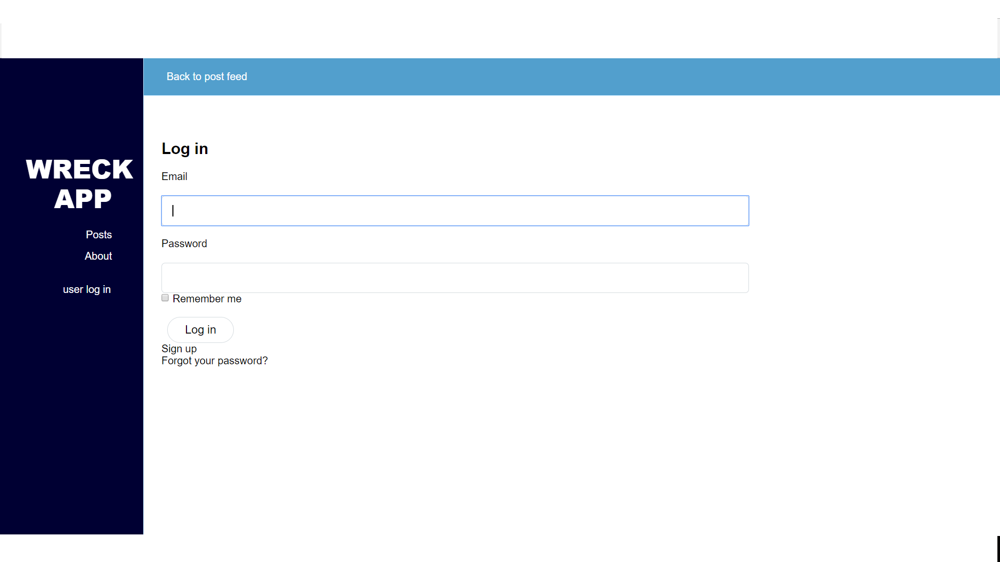
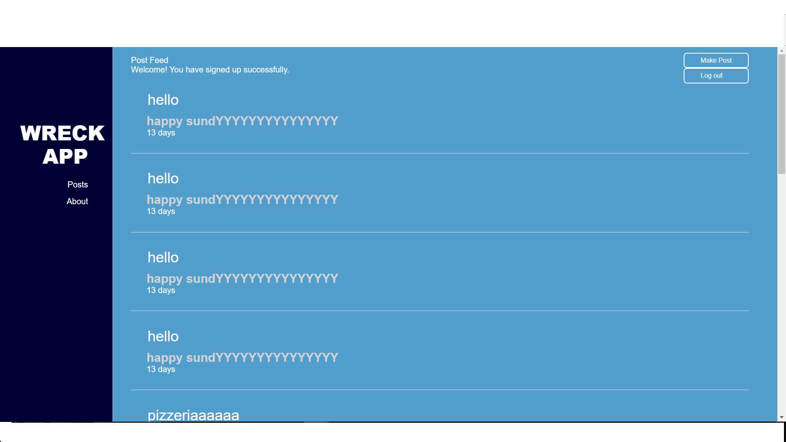
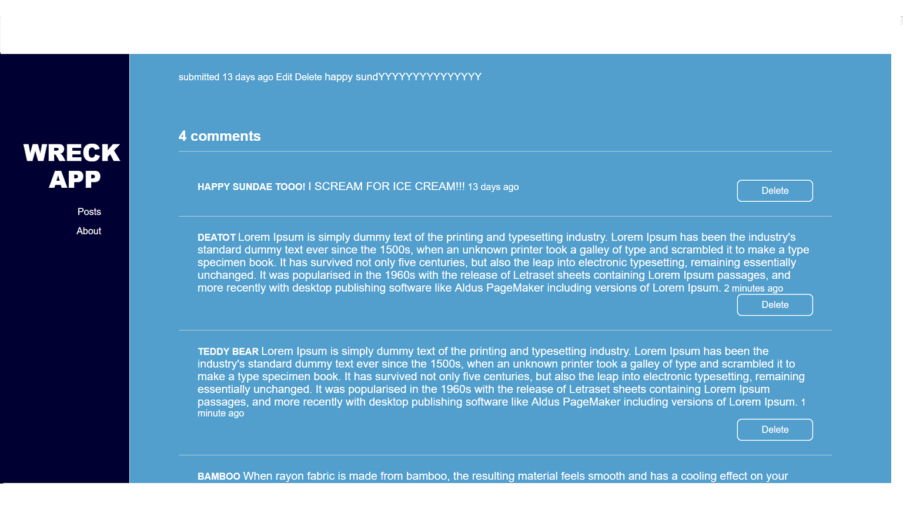
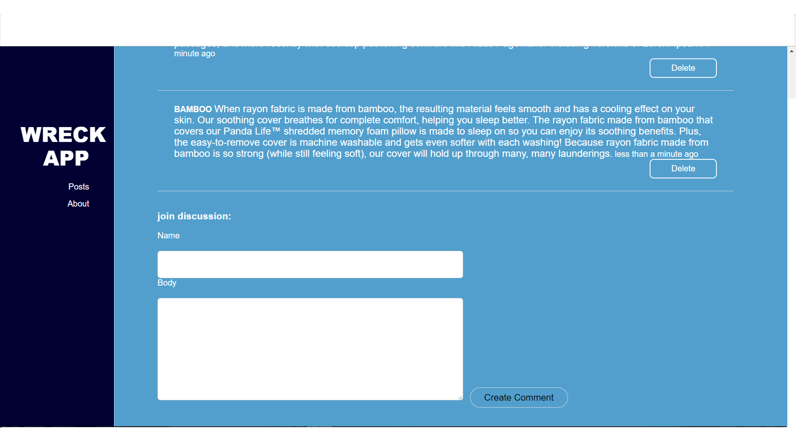
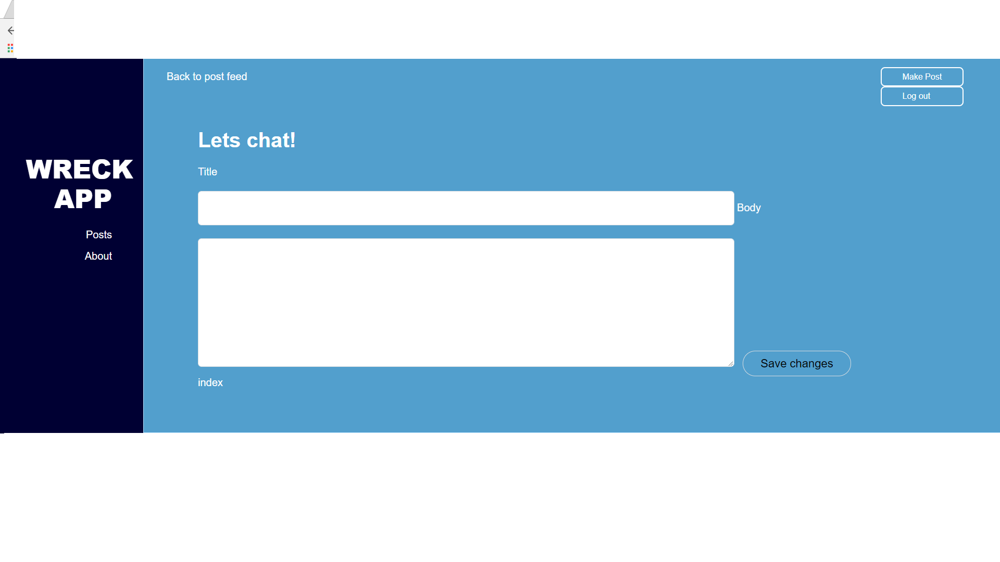

Posting forum is a basic app for posting messages only. The user has the capability to post messages and the other users can put up comments. The main message is posted at the top and then the comments are tagged below. The show page is composed of the userid, 
title and comment. There are other pages as well which are the create, edit and delete part. Aside from that, the messages are also
dated so everyone would know the date the message was created. Below are the snapshots of the app. 
* This app was also name as wreck app. The original concept is that the user can post concerns and others can join the discussion.

* This is the what you would see upon opening the app: 

* This is the index page that would show the general messages:

* This page shows the list of comments that includes userid, title and comment.

* Page for joining the discussion

* Creating the message

